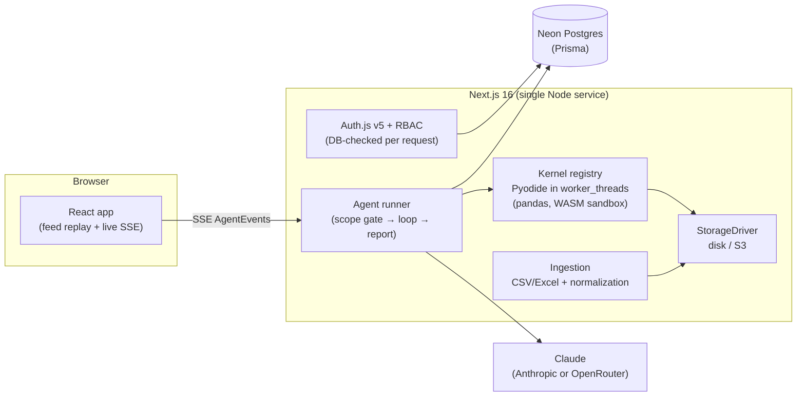

# 🔎 Glass Box — The data analysis companion that shows its work

**A multi-tenant SaaS for decision makers.** Upload any CSV or Excel file, ask questions in plain English, and watch a transparent AI analyst plan, write Python, execute it, self-correct, chart, and deliver an executive report — then keep asking follow-ups. Every step is visible. Every action is audited. The agent answers **only** from your data.

Built with Claude for the **India Builds with Claude** event (Anthropic × Razorpay).

---

## What it does

- **Sign up → workspace → upload → insight** in under two minutes. Messy files welcome: title rows, merged headers, `$1,200,500` strings, `(300,200)` accounting negatives, percent signs, duplicate columns, multi-sheet workbooks — the ingestion pipeline cleans them and **shows you exactly what it changed**.
- **Conversational analysis.** Each answer ends in a decision-grade report (headline, hero metrics with trends, confidence-scored insights, recommendation). Ask follow-ups; the agent keeps its context.
- **The glass box.** Every run's full agent trace — plan, generated Python, real output, and self-corrections — is one click away, live and after the fact.
- **Scoped, governed agent.** A scope gate refuses off-topic questions before any compute runs. Python executes in a WASM-sandboxed kernel with an audited guardrail (no filesystem, no network, no os/sys).
- **Team-ready.** Organizations with OWNER / ADMIN / MEMBER / VIEWER roles, enforced in the database on every request. Invitations, org switching, and a full audit log.
- **Share what matters.** One click turns a report into a public read-only link (revocable; views audited).
- **Data lifecycle.** Soft delete, GDPR-style hard delete (rows + stored files + kernel eviction), and org-level retention policies swept automatically.

## Architecture



- **One AgentEvent vocabulary** drives live streaming, database persistence, and replay — the reasoning feed renders identically during a run and when you reload a conversation.
- **Python runs server-side in Pyodide (WebAssembly) kernels** inside Node worker_threads: one warm kernel per active conversation (LRU + TTL), 15s hard timeout via thread termination, dataframes reloaded from storage on rebuild.
- **Reports can never be empty**: a dedicated non-streaming call composes the executive report, with tolerant parsing and a text fallback.

## What reaches the AI model — precisely

The column schema, a 20-row sample, up to 4,000 characters of printed output per analysis step, and chart JSON. **Never the full file.** Files live in your workspace's storage; access is role-enforced; every upload, run, guardrail block, share, and deletion lands in the audit log. We ship compliance-ready *mechanisms* (RBAC, audit trail, hard deletion, retention, encryption at rest via your Postgres/storage provider) — compliance itself is a process you run on top of them.

## Local setup

```bash
pnpm install

# 1. Local database (no Docker needed — Prisma's dev Postgres)
pnpm exec prisma dev -d --name glassbox     # note the URLs it prints (also: prisma dev ls)
cp .env.example .env                        # paste DATABASE_URL + MIGRATE_DATABASE_URL
pnpm exec prisma db push                    # apply schema locally

# 2. Secrets
cp .env.example .env.local                  # set AUTH_SECRET + a model provider key

# 3. Run
pnpm dev                                    # http://localhost:3000
```

First analysis in a conversation takes ~6–10s extra while its Python kernel boots (pandas wheels are disk-cached after the first ever run).

### Model provider

Set **one** of `ANTHROPIC_API_KEY` (native, preferred) or `OPENROUTER_API_KEY` (OpenAI-format, translated server-side). Same model either way: `claude-sonnet-5`.

## Deployment (Railway / Render / any persistent Node host)

The warm kernel pool and SSE streams need a **persistent Node process** — serverless won't fit. Provision 4–8 GB RAM and a volume for `DATA_DIR`, set the env vars from `.env.example` (Neon pooled URL as `DATABASE_URL`, direct URL as `MIGRATE_DATABASE_URL`), run `prisma migrate deploy`, then `next build && next start`. Bake the Pyodide wheels into the image by running one kernel boot during build so production never touches the CDN.

## Project layout

```
app/                  landing, auth pages, /app shell, /share/[token], API routes
components/app/       workspace, dataset detail, members, settings, shell
lib/                  auth, authz (RBAC), audit, feed reducer, agent events/types
lib/agent/            providers (Anthropic/OpenRouter), report composer, stream client
server/agent/         runner (the loop) + scope gate
server/exec/          Pyodide kernel worker + registry (LRU/TTL, timeouts)
server/ingest/        type detection, parsing, messy-data normalization, sampling
server/storage/       StorageDriver (disk today, S3-compatible next)
prisma/               multi-tenant schema (orgs, roles, datasets, conversations, audit)
```

## License

MIT — see [LICENSE](./LICENSE).
