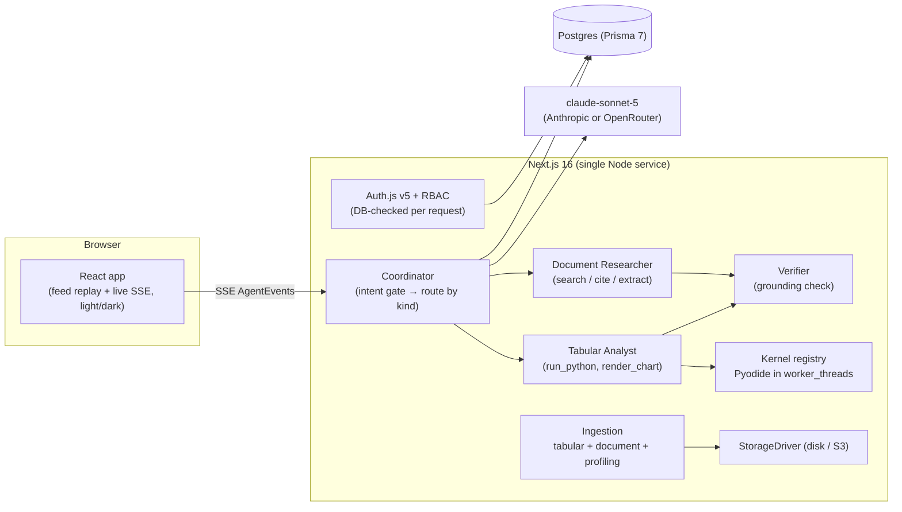

# 🔎 Glass Box — the governed AI analyst your team owns

**A self-hostable, multi-tenant decision-support platform.** Point it at your spreadsheets *and* your documents, ask in plain English, and watch a transparent Claude-powered analyst answer — planning, writing and running Python, self-correcting, charting, and (when it matters) delivering a decision-grade report. For documents it retrieves, reasons, and **cites the exact clauses**. Every answer shows its work. Every action is audited. It answers **only** from your data — and it runs on **your** infrastructure.

Built with Claude for the **India Builds with Claude** event (Anthropic × Razorpay). Powered end-to-end by **`claude-sonnet-5`**.

---

## Why this instead of pasting a file into ChatGPT?

A generic chat upload doesn't know *who* you are, treats your file as raw dtypes, keeps no history, and sends your data to a third party. Glass Box is a **governed, ownable vertical product**:

- **Role-aware.** It knows the user is a *Sales / Support / Finance / Operations leader or a Consultant*, plus your workspace **domain × vertical**, and frames every answer accordingly.
- **Data-aware.** It profiles each source (semantic column types, ranges, a cached Claude "domain read") so it starts sharp instead of rediscovering your schema.
- **Governed & owned.** Per-request RBAC, a full audit trail, and **self-hosted deployment** — your data never leaves your infrastructure. That's the wedge Claude Enterprise and a raw API can't offer for a team tool.
- **Guided.** Persona × data starter questions and per-answer follow-ups turn a blank box into a decision journey.

---

## What it does

### Two modalities, one metaphor — *show the evidence*
| Pillar | Sources | Engine | "Shows its work" = |
|---|---|---|---|
| **Tabular analytics** | CSV / Excel | pandas in a WASM-sandboxed Pyodide kernel | the generated Python + its real output |
| **Document intelligence** | PDF / DOCX / TXT | Claude retrieve → reason → **cite** | the exact quoted clauses |

- **Conversational by default.** A quick question ("how many prospects?") gets a fast inline answer — no ceremony. Only decision-grade questions ("where should I focus next quarter?") escalate to a full report (headline, hero metrics, confidence-scored insights, recommendation).
- **User-selectable depth.** An **effort dial** (Low / Medium / High) trades speed for depth per question; Low by default for cost.
- **Documents / RFPs.** Ask for "every mandatory requirement" and get a cited list; upload a **v2** and **compare** to see exactly what changed (SLA tightened, Net-30 → Net-45, new clause) — the procurement/audit wedge.
- **Versioned sources.** Every upload is a versioned artifact; conversations pin a version, adopt newer ones, and diff any two (structural + semantic).
- **The glass box.** Every run's trace — plan, Python, real output, self-corrections, citations — is one click away ("Show the work"), live and on reload. A **verifier** checks every reported number against the evidence before a report ships.
- **Team-ready SaaS surface.** OWNER/ADMIN/MEMBER/VIEWER enforced in the DB per request, invitations, multiple workspaces, a full audit log, usage metering + dashboard, per-org rate limiting, and one-click **shareable, revocable** report links.
- **Light & dark mode**, uniform across the app.

---

## Architecture — coordinator + specialized workers, all Claude, self-hosted



- **Orchestrator-worker pattern** (per the Claude Agent SDK / Architect playbook), self-hosted on `@anthropic-ai/sdk` so the sandbox, the transparency stream, and the data stay on your infra — not Managed Agents.
- **One `AgentEvent` vocabulary** drives live streaming, DB persistence, and replay — the feed renders identically live and on reload.
- **Context Pack** — persona × domain × vertical + source profile — is assembled once and injected into the prompt, gates, and UI (prompt-cached).
- **Single model, user-selectable effort** — `claude-sonnet-5` everywhere; the dial is effort, never a cheaper model.

## What reaches the model — precisely

Tabular: the column schema + semantic profile, a 20-row sample, and up to 4,000 chars of printed output per step. Documents: retrieved passages, cited by anchor. **Never the full file.** Files live in your storage; access is role-enforced; every upload, run, guardrail block, share, and deletion is audited. Ships compliance-ready *mechanisms* (RBAC, audit, hard deletion, retention, encryption-at-rest via your provider); compliance is a process you run on top.

---

## Deploy it (production, on your own box)

The warm kernel pool + SSE need a **persistent Node process** — serverless won't fit. The repo ships a complete self-hosted stack: **Docker Compose (Postgres + standalone Next.js + Cloudflare Tunnel), no host ports, survives reboots.** See **[DEPLOY.md](./DEPLOY.md)** — the short version:

```bash
cp .env.production.example .env      # fill secrets (see DEPLOY.md)
docker compose up -d --build db      # start Postgres
docker compose run --rm migrate      # apply schema (Prisma db push)
docker compose up -d app cloudflared # app + public HTTPS tunnel
# grab the printed *.trycloudflare.com URL, set AUTH_URL to it, restart app
```

`scripts/eval.mjs <url>` is an end-to-end smoke test (quick-fact → no report, decision → report, starters generated) for CI / post-deploy gating.

## Local development

```bash
pnpm install
pnpm exec prisma dev -d --name glassbox   # bundled dev Postgres; note its URLs
cp .env.example .env                       # DATABASE_URL + MIGRATE_DATABASE_URL
pnpm exec prisma db push
# set AUTH_SECRET + one model key (below) in .env
pnpm dev                                   # http://localhost:3000
```

First analysis boots a Pyodide kernel (~6–10s; pandas wheels are disk-cached after the first run).

### Model provider
Set **one** of `ANTHROPIC_API_KEY` (native, preferred) or `OPENROUTER_API_KEY` (OpenAI-format, translated server-side). Model: **`claude-sonnet-5`**.

## Project layout

```
app/                     landing, auth, /app shell, /share/[token], API routes
components/              feed cards, report panel, charts, markdown, theme toggle
components/app/          conversation workspace, dataset/document detail, shell, settings
lib/agent/               context pack, personas, providers, suggestions, verifier,
                         dataset/document intelligence, events, report composer
server/agent/            coordinator + tabular runner + document engine + intent gate
server/exec/             Pyodide kernel worker + registry (LRU/TTL, 15s timeout)
server/ingest/           tabular normalization + document extraction + column profiling
server/storage/          StorageDriver (disk today, S3-compatible next)
prisma/                  versioned Source/SourceVersion, orgs/RBAC, conversations, audit
docs/                    INTELLIGENCE_BUILD_PLAN.md (the v3 design)
```

## License

MIT — see [LICENSE](./LICENSE).
